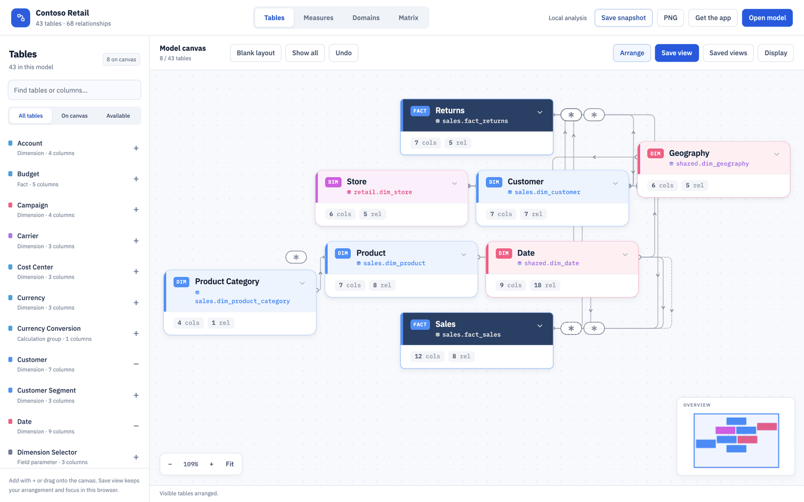
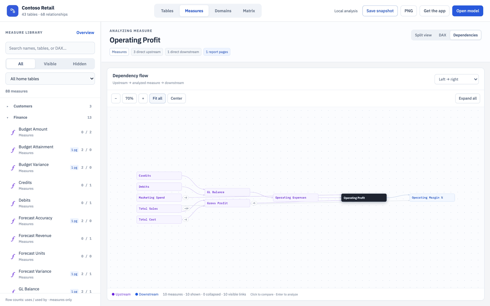
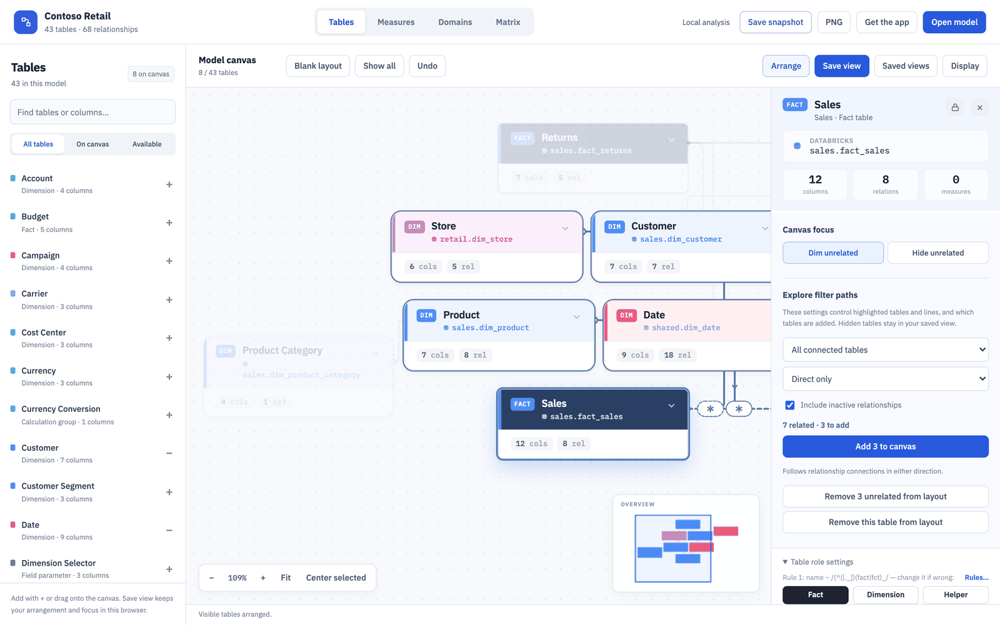
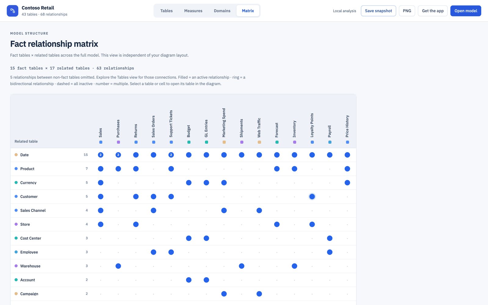
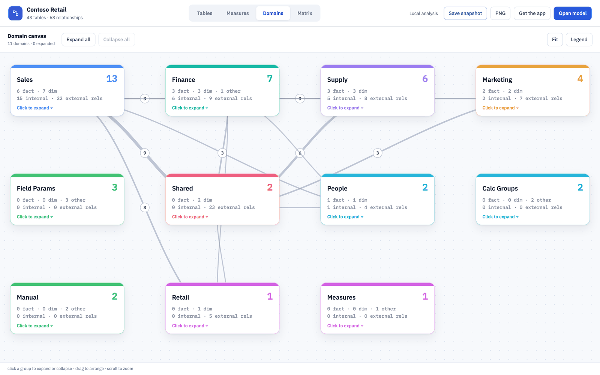

# Semantic Model Viewer

**See how a Power BI semantic model fits together: tables, relationships and the DAX behind every measure.**

[](https://github.com/MrPerfectH/Semantic-Model-Viewer/actions/workflows/ci.yml)
[](LICENSE)
[](https://github.com/MrPerfectH/Semantic-Model-Viewer/releases/latest)

### 👉 [Try the live demo](https://MrPerfectH.github.io/Semantic-Model-Viewer/)

No install needed. The demo opens with a synthetic "Contoso Retail" model already loaded.

[](https://MrPerfectH.github.io/Semantic-Model-Viewer/)

## Why use it

* **Explore tables and relationships.** Build a canvas of just the tables you care about, with a star
  layout, filter-path highlighting and a table inspector.
* **Follow a measure through its DAX.** Pick a measure and see everything that feeds it (upstream, purple)
  and everything built on it (downstream, blue), with side-by-side DAX, hidden-measure flags and
  per-measure report usage.
* **Share a single-file offline snapshot.** One HTML file holds the whole model. The recipient needs no
  install and no connection to the model.
* **Runs locally.** Your models are parsed on your own computer and never leave it.

It reads TMDL (`*.SemanticModel` folders and `.pbip` repos) and `model.bim`. It also renders a
relationship matrix and a domain map of the whole model.

## Install (2 minutes)

The viewer runs on your own computer from a copy of this repo. A small local app
(`Models/tools/viewer/scripts/serve.py`, Python, no extra packages) serves the page and
reads your model folders for it, so **the browser never asks for permission to view a
folder**: you pick folders in the viewer itself, and **Refresh** re-reads them silently.
Your models never leave your machine.

Needs **Python 3** and **Chrome or Edge** (other browsers work, in a normal tab).

1. Get the repo: `git clone https://github.com/MrPerfectH/Semantic-Model-Viewer.git`
   (or **Code → Download ZIP** on GitHub and unzip it).
2. Install Python 3 if you do not have it: [python.org](https://www.python.org/downloads/)
   (Windows: tick **Add python.exe to PATH**; Mac: python.org, or `xcode-select --install`).
3. Double-click the installer in the repo folder:
   - **Mac:** `Install on Mac.command`. It adds **Semantic Model Viewer** to
     `~/Applications`; drag it to the Dock.
   - **Windows:** `Install on Windows.cmd`. It adds a Desktop icon and a Start menu entry.
4. The app opens in its own window. Use **Open model → Import model → Browse folder…**
   or **Connect repo folder…** and pick a `*.SemanticModel` folder, a `.pbip` repo folder
   (every model inside is found) or a folder holding `model.bim`. Dragging a folder onto the
   window still works too.

If you downloaded the ZIP, macOS or Windows may warn about the installer the first time
because it came from the internet. On Mac, right-click `Install on Mac.command` → **Open**;
on Windows, choose **More info → Run anyway**. Cloning with git avoids the warning.

**What the local app does:** it listens on `http://localhost:8931` on this computer only,
only ever reads files (`.tmdl`, `.bim`, `.json`), refuses requests from other websites
open in your browser, and stops itself a few minutes after you close the window.
Nothing runs at login.

**Updating:** run `git pull` in the repo folder (or download the ZIP again into the same
place) and reopen the app. Your saved models and layouts are kept.

**Uninstalling:** `Models/tools/viewer/scripts/mac/uninstall-app.sh` or
`Models\tools\viewer\scripts\windows\uninstall-shortcuts.ps1`. On Mac,
`Models/tools/viewer/scripts/mac/reset-app-data.sh` clears just the saved models and layouts.

The app window uses its **own, separate browser profile**, never your regular one, so it
keeps its saved models apart from your everyday browsing. On Mac, opening the app again
opens a viewer window using that same profile; if a viewer window is already open, this
can create another one. Close extra windows normally; your saved models and layouts are kept.

### VS Code

Download `semantic-model-viewer-<version>.vsix` from the
[Releases page](https://github.com/MrPerfectH/Semantic-Model-Viewer/releases), then in VS Code run
**Extensions: Install from VSIX…** from the Command Palette (or
`code --install-extension <file>.vsix`). Details: [vscode-extension/README.md](vscode-extension/README.md).
To update, install the newer `.vsix`.

### Online demo

<https://MrPerfectH.github.io/Semantic-Model-Viewer/> opens the same viewer with the
built-in synthetic "Contoso Retail" model already loaded, so you can look around before
installing. You can import your own model there as well; it is parsed in your browser and
not uploaded, but because the page itself reads the folder, the browser shows a one-time
"allow this site to view files" prompt that the installed app never does.

## About the app

The app is a static, dependency-light vanilla JS/HTML/CSS app. No build step, no bundler,
no npm install. The live app uses Google Fonts for IBM Plex Sans/Mono (cached after the
first visit; the system font is used if they cannot be loaded) and loads the PNG export
library on demand. Interactive snapshots bundle their own scripts/styles, use system fonts,
and run entirely offline.

```
Models/tools/viewer/
├── index.html            entry point
├── js/                   app code (see below)
├── sw.js, manifest.webmanifest, icons/   installable-app (PWA) support
├── model-data.json       built-in sample dataset — the synthetic "Contoso Retail" demo
├── report-usage.json     built-in sample dataset — synthetic report scan
└── scripts/              the two data-pipeline build scripts (Python)
Models/demo/              TMDL source of the demo model
```

## Run it from source

```bash
python3 Models/tools/viewer/scripts/serve.py --open
# Semantic Model Viewer: http://localhost:8931
```

That is all the installers do (plus opening it as an app window). `--idle-exit 180` makes
it stop after the window has been closed for three minutes; `--port` picks another port.

Without the local app, `Models/tools/viewer/index.html` also opens straight from disk or
from any static host (`python3 -m http.server` in that folder works). Folders are then read
by the browser itself, which asks for permission once per folder, and the built-in demo
model needs a web server to load.

A fresh browser profile starts with **No model selected** (the hosted demo opens the sample
instead). Import your model or connect a repository; once chosen, the model is restored on
reload.

## VS Code extension

The viewer also runs inside VS Code. Open a workspace containing a `.SemanticModel`
folder or `model.bim`, then use the **Semantic Models** Activity Bar or **Semantic
Model Viewer: Open Model…**. It uses the same table workspace, measures, and offline
snapshot format as the web app. Model files refresh when edited; layouts are saved
per model in the VS Code workspace.

See [extension installation and development](vscode-extension/README.md). The package
is built from `Models/tools/viewer`, so there is one maintained viewer. Optional
Semantic Model Cleaner integration loads report usage from an existing analysis file
or runs the cleaner in a trusted workspace. The web app and Python data pipeline
continue to work as before.

## Share an interactive snapshot

Open your model, choose the starting view, and click **Save snapshot**. Share the
single downloaded HTML file. The recipient opens it in a desktop browser and can
explore **Tables, Measures, Domains, and Matrix** without installing anything or
connecting to the semantic model. Saved table views, formulas, comparisons, focus,
layout preferences, and graph positions travel with the file.

### Generate a snapshot from TMDL

With Node.js 22+, export an offline, interactive HTML snapshot from a TMDL folder:

```bash
node bin/smv.cjs snapshot "Models/demo/Contoso Retail.SemanticModel" --out snapshot.html
```

Open the file in a browser to explore the model. Optionally use `--tables` or
`--measure` to choose the starting view; the full model remains available.
No extra packages or browser are needed to export. See [CLI usage](docs/cli.md).

A snapshot contains the **full model metadata and DAX**, even if the starting canvas
is empty or focused on a few tables. It is frozen at the displayed creation time.
Recipients can use **Save snapshot** again to keep their presentation changes in a
new file. See [snapshot sharing and offline behavior](docs/snapshots.md).

## Screens

| Screen | What it does |
| --- | --- |
| **Tables** | Starts with a blank layout and a searchable library of every model table. Add tables with + or drag them onto the canvas, show all, remove tables, undo layout changes, arrange visible tables and save named views with selection, focus, zoom, and card display settings. Panning preserves selection. Each model keeps its own membership and positions. The overview map supports click/drag and arrow-key navigation; Fit and keyboard-accessible zoom sit beside the canvas. |
| **Table inspector** | Source, columns, measures and relationships for a selected table. Dim or hide unrelated tables with direct, two-hop or transitive focus; hidden tables remain in the layout. Explore tables that filter it, tables it filters, or all connected tables. Choose direct or direct + indirect paths and optionally include inactive relationships. Filtering follows model metadata; it does not simulate DAX or RLS. Table role rules remain under Display and the inspector's Table role settings. |
| **Measures** | Search names, folders, home tables or DAX, filter visible/hidden measures, and inspect dependency and dependent counts. Split view places DAX beside or below the graph with a pointer/keyboard divider; dedicated DAX and Dependencies modes provide more room. Graphs run left-to-right, top-to-bottom or bottom-to-top. DAX comparison uses the full panel width. Workspace preferences persist in this browser. Graph opens at readable scale with Fit all/Center/zoom. Click a reference to compare formulas, then Analyze this measure to re-root. Copy DAX, line wrapping and detected column references are included. |
| **Domains** | Full-model domain/source groups with aggregated relationships and expandable group cards. |
| **Matrix** | Full-model fact-centered relationship matrix, with explicit scope, semantic cells and navigation back to the table diagram. Models without connected fact tables get an explanatory empty state. |


| Measure dependency flow | Table inspector |
| --- | --- |
|  |  |
| **Relationship matrix** | **Domains** |
|  |  |

### Layouts

Display → Auto layout picks the arrangement, and the Arrange button applies it to the tables
currently on the canvas (Undo restores the previous one).

* **Star** (default) puts the conformed dimensions in one block in the middle and rides the
  facts on an ellipse around it, each fact's own dimensions just outside its seat, so every
  relationship is a short spoke instead of a line across the canvas. A subset with a single
  fact keeps the simpler picture: one centre with its dimensions on a ring.
* **Constellation** is a small force simulation over the whole model — hubs push each other
  apart, a conformed dimension is pulled to the middle of the facts it serves. Good for a
  model with no clear fact/dimension split.
* **Layered** is the Kimball picture people draw by hand: dimensions in a row on top, facts
  underneath, each fact under the middle of the dimensions it uses.

Galaxy rows, star columns, waterfall and grid remain for models these three do not suit.
Lanes are cut for the *chip* the reader sees, not for the collapsed card: a chip title is
held between 11 and 13 CSS pixels at every zoom, so the box grows as the zoom drops, and the
arrangement reserves room for the largest it reaches between 20% zoom and the point cards
come back. That is why a whole model fits at around 20-25% rather than 40% — the same
picture, drawn without two names landing on top of each other.

Two badges appear everywhere a measure is listed:

* grey **eye-off** icon — the measure is `isHidden` in the model (`h: 1` in `model-data.json`),
* blue **`N pg`** pill — the measure is used in the scanned report; the tooltip breaks it
  down per page (`• <page> — 2 visuals, 1 filter`).

Models can also be imported ad hoc: drag a `.pbip` repo folder, a `*.SemanticModel` folder
or a `model.bim` onto the window (parsed in-browser by `js/tmdl-parser.js`, kept in
`localStorage`). Chrome/Edge additionally offer “Connect repo folder…”, which scans a
folder for `*.SemanticModel` and re-parses on every open.

## Data pipeline

```
TMDL sources                      Reports (PBIR)
Models/<Model>.SemanticModel/     Reports/<Report>.Report/
  definition/*.tmdl                 definition/pages/*/visuals/*/visual.json
        │                                 │
        ▼ (build step 1)                  ▼ (build step 2)
  model-data.json                  report-usage.json
        └────────────┬────────────────────┘
                     ▼
              Viewer (static app)
```

Both scripts live in `Models/tools/viewer/scripts/` and run standalone with `python3`
(stdlib only, no dependencies):

```bash
# build step 1 — TMDL -> model-data.json
python3 Models/tools/viewer/scripts/tmdl_to_model_data.py \
    "Models/demo/Contoso Retail.SemanticModel" \
    -o Models/tools/viewer/model-data.json

# build step 2 — PBIR reports -> report-usage.json (+ report-health.json)
python3 Models/tools/viewer/scripts/scan_report_usage.py Reports \
    --model-data Models/tools/viewer/model-data.json \
    -o Models/tools/viewer/report-usage.json
```

`tmdl_to_model_data.py` is a line-by-line port of the browser parser
(`js/tmdl-parser.js`) — same regexes, same role/domain heuristics, same output — so
in-repo snapshots and drag-and-drop imports agree. Keep the two in sync when either
changes.

### Wiring into your own repo

Both JSON files are derived artefacts; the point of the scripts is that nobody hand-edits
them. Two options, in order of preference:

* **Pre-commit hook** — regenerate whenever model or report definitions change, so the
  committed JSON always matches the TMDL in the same commit:

  ```yaml
  # .pre-commit-config.yaml
  - repo: local
    hooks:
      - id: viewer-model-data
        name: viewer — rebuild model-data.json
        entry: python3 Models/tools/viewer/scripts/tmdl_to_model_data.py "Models/demo/Contoso Retail.SemanticModel" -o Models/tools/viewer/model-data.json
        language: system
        pass_filenames: false
        files: '^Models/.*\.SemanticModel/definition/.*\.tmdl$'
      - id: viewer-report-usage
        name: viewer — rebuild report-usage.json
        entry: python3 Models/tools/viewer/scripts/scan_report_usage.py Reports --model-data Models/tools/viewer/model-data.json -o Models/tools/viewer/report-usage.json
        language: system
        pass_filenames: false
        files: '^Reports/.*\.Report/definition/.*\.json$'
  ```

* **CI job** — run both scripts and fail the build if `git diff --exit-code` shows the
  committed JSON is stale. Same commands; this catches commits made without the hook
  installed and is the safer belt-and-braces option if the repo already runs CI on PRs.

If the repo prefers not to commit derived JSON at all, publish the viewer folder plus the
two generated files as a CI artefact (or to the docs site) instead — nothing in the app
depends on them being in git.

### Report health

`scan_report_usage.py` also writes `report-health.json` next to its output, listing measure
names referenced by visuals or filters that no longer exist in the model (broken report
references). It prints them to stderr too, which makes it
easy to turn into a CI warning.

### Where a table's data comes from

Partitions rarely name their connector — a partition says `Source = VerticaPath` and the
real `Vertica.Database(...)` call sits in a shared expression. The parser therefore follows
the first `Source =` reference (through shared expressions *and* other tables' partitions)
until it finds a connector call, then reports the connector, the object, the host and the
shared query it came through. Recognised: Databricks, Vertica, SQL Server, Oracle,
PostgreSQL, MySQL, Snowflake, Synapse, Fabric/Lakehouse, Analysis Services, SAP, ODBC,
Dataflows, SharePoint, Azure Storage, Salesforce, Folder, Excel, CSV, Web and OData, plus
`manual` (inline rows), `calculated` (DAX) and `parameter` (query parameters). Anything
else stays `Other`. Both parsers implement this — keep `js/tmdl-parser.js` and
`scripts/tmdl_to_model_data.py` in step.

### How a table gets its role (fact / dim)

Every table gets a `role`; the graph, matrix and sidebar all read it. Calc groups, field
parameters and measure-only tables are fixed (`calcgroup`, `fieldparam`, `measures`). For
everything else an ordered **rule list** decides — the first rule whose conditions all hold
wins, and a rule with no conditions catches the rest. The built-in rules:

| # | Role | When |
|---|---|---|
| 1 | fact | source table name matches `(^|[._])(fact|fct)_` |
| 2 | dim | source table name matches `(^|[._])dim_` |
| 3 | helper | manual table, no relationships |
| 4 | helper | calculated table, no relationships |
| 5 | standalone | no relationships |
| 6 | fact | only on the many side of its relationships |
| 7 | dim | only on the one side |
| 8 | fact | more many-side than one-side relationships |
| 9 | dim | more one-side than many-side relationships |
| 10 | dim | everything else (ties) |

Each rule can test the name (regex against source table + table name), the relationship
sides, whether the table has measures, and its source kind (source / manual / calculated).
**Roles › Rules** in the top bar opens the editor: reorder, edit, add or remove rules, see how
many tables each one decides, reset to the defaults. Edits apply at once and live in
`localStorage`. **Copy JSON** exports the set so the build script can use the same rules:

```bash
python3 Models/tools/viewer/scripts/tmdl_to_model_data.py "<model>.SemanticModel" --rules my-rules.json -o model-data.json
```

Two things sit above the rules:

* **`annotation SMV_Role = fact | dim | helper | standalone`** on a table in TMDL pins the role
  in the model itself. It beats every rule, in the viewer and in the build script. Power BI
  Desktop's TMDL view, Tabular Editor 2/3 or a text editor all work, and the annotation
  survives deploy and round-trip. In `.bim` it is `"annotations": [{"name": "SMV_Role", "value": "fact"}]`.

  ```tmdl
  table Sales
  	lineageTag: 9a48bea0-e5fb-40fa-9e81-f61288e31a02

  	annotation SMV_Role = fact
  ```

* **A per-table pick** in the table panel (Fact / Dimension / Helper) saves `SMV_Role`
  directly into the table's `.tmdl` file when opened through **Connect repo folder** in
  Chrome/Edge (including the Mac launcher). The browser requests write access on the first
  change. **Auto** removes the annotation. The panel shows the saved file or an error;
  failed writes do not change the role. Commit and push the TMDL change to share it through Git.
  Repo models ignore old browser-only role overrides, so the shared annotation wins.
  Disconnected repo caches must be reconnected before editing. Other imports and the VS Code
  viewer still use explicitly labelled browser-local picks. Automatic write-back currently
  requires TMDL, not BIM/JSON.

The engine lives in `js/roles.js` and is mirrored in `scripts/tmdl_to_model_data.py` — keep
`DEFAULT_RULES` identical in both.

## Source layout

| File | Role |
| --- | --- |
| `js/util.js` | DOM/SVG helpers, localStorage wrapper, inline SVG icon set |
| `js/tmdl-parser.js` | TMDL/BIM → model JSON, used for in-browser import (including `isHidden` on measures and connector detection) |
| `js/canvas.js` | Table cards, pan/zoom, level-of-detail, relationship edges, selection/highlighting, fit, presets |
| `js/layouts.js` | Arrange algorithms (star / constellation / layered / grid / galaxy / star columns / waterfall) and cluster mode |
| `js/matrix.js` | Relationship matrix |
| `js/measures.js` | Measures rail, dependency DAG layout, DAX tokenizer, DAX cards |
| `js/sidebar.js` | Table detail drawer |
| `js/topbar.js` | Top bar, model menu, legend, hint chip, import modal |
| `js/app.js` | State, model loading, usage data, import, repo connection |

State that persists in `localStorage`: `lsa_model_layout_v1` (built-in model card
positions), `smv_layout_<id>` / `smv_presets_<id>` (imported models), `smv_models_v1`,
`smv_current_v1`, `smv-detail`, `smv-layout`, `smv-lines`, `smv-mvw`, `smv_repo_name`,
`smv_repo_cache`, `smv-measures-workspace-v1`.

## Regression checks

No installation is needed. With Node.js available:

```bash
node vscode-extension/scripts/sync-viewer.js
node --test tests/*.test.cjs Models/tools/viewer/tests/*.test.js tests/extension.test.js tests/usage-adapter.test.js
```

The tests cover relationship traversal, canvas membership/persistence, dependency parsing, model isolation, storage failures, measure controls, matrix behavior and escaped tooltip content. These fixtures do not establish full parser or browser compatibility.

Working-canvas membership lives in `smv_workspace_v1_<modelKey>`; named views include membership, positions, viewport, selection, pinned/locked roots, hide-unrelated focus, and card display settings. Older presets without membership restore the tables present in their positions. Undo history lasts for the current model session.

Real Chrome layout checks (Node.js 22+, installed Chrome; optionally set `CHROME_PATH`):

```bash
node --test tests/star-layout.browser.cjs tests/measures-layout.browser.cjs tests/snapshot.browser.cjs
```

These use a disposable browser profile and the shipped CSS/JS. The measures checks cover wide-screen formula sizing, split placement, resizing, orientation and preferences; `star-layout.browser.cjs` opens the bundled model at 1440x900, runs Show all and Fit, and asserts against real DOM rects that no two cards are drawn on top of each other and that every table name stays between 11 and 13 CSS pixels.

## Feedback and contributing

Bug reports, ideas and questions are welcome through
[GitHub Issues](https://github.com/MrPerfectH/Semantic-Model-Viewer/issues). To contribute code, read
[CONTRIBUTING.md](CONTRIBUTING.md) first. To report a security problem privately, follow
[SECURITY.md](SECURITY.md). The project is released under the [MIT License](LICENSE).

## About the author

Semantic Model Viewer is built and maintained by Przemek Harazny
([@MrPerfectH](https://github.com/MrPerfectH)) as a personal open-source project. The demo
model and its screenshots use only synthetic data.
